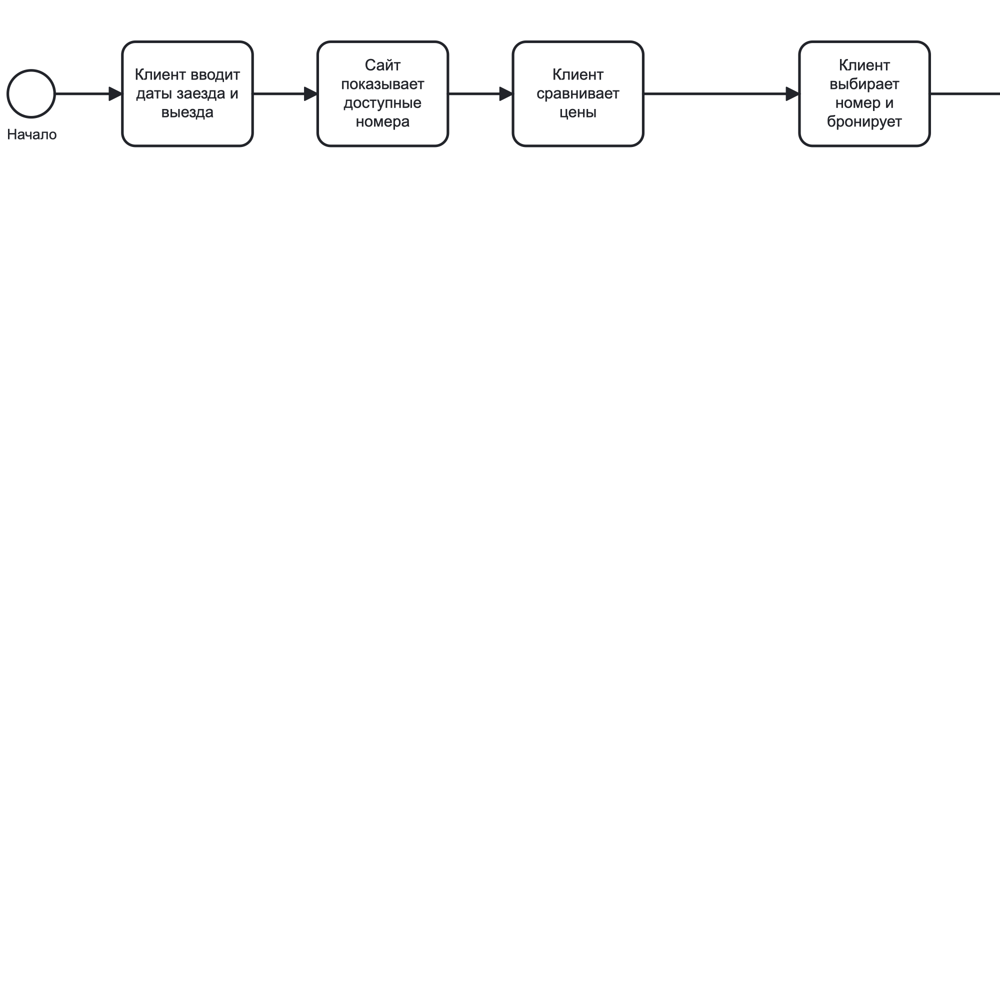
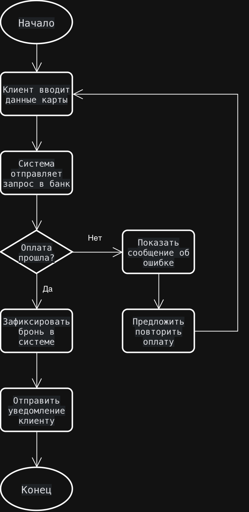
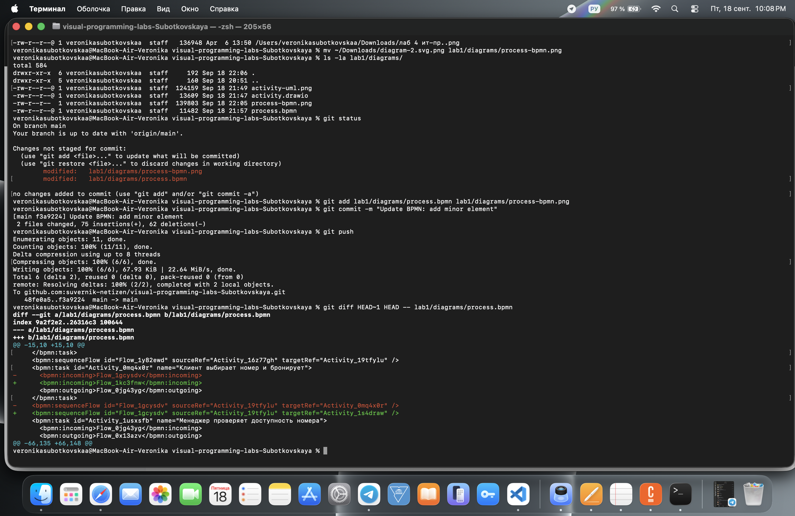
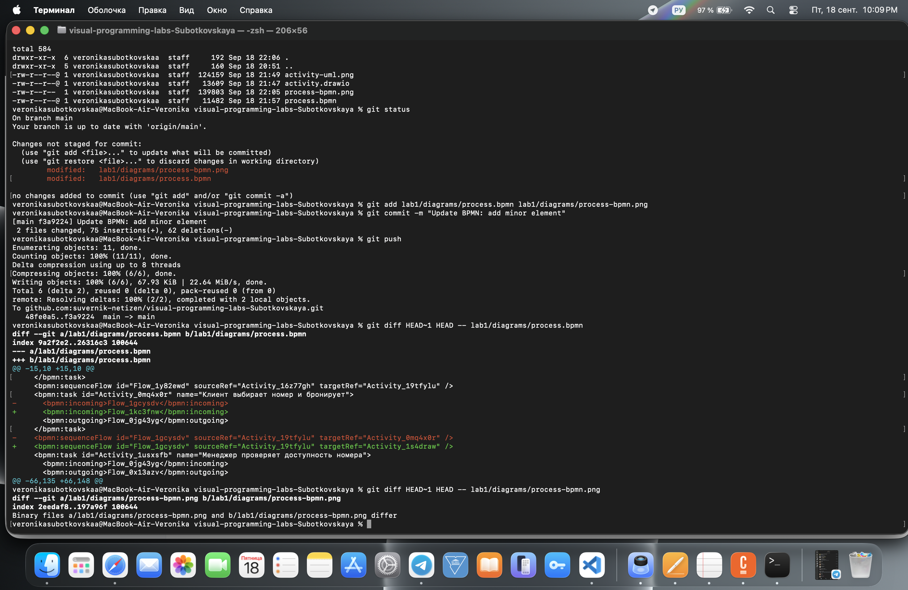

# Отчёт по лабораторной работе №1

## Тема процесса
Бронирование номера в отеле через онлайн-систему.

## Описание процесса
Клиент заходит на сайт бронирования, вводит даты заезда и выезда, система показывает доступные номера. Клиент выбирает подходящий номер и оформляет бронь. Менеджер отеля проверяет доступность номера на указанные даты. Если номер доступен, клиент переходит к оплате. После успешной оплаты система фиксирует бронь, менеджер вносит данные в журнал, а служба подтверждения отправляет клиенту письмо и SMS с деталями. Если номер недоступен или оплата не прошла, клиенту предлагаются альтернативы или повторная оплата.

## Диаграммы

### BPMN

Исходный файл: [process.bpmn](diagrams/process.bpmn)

### UML Activity Diagram

Исходный файл: [activity.drawio](diagrams/activity.drawio)

### Sequence Diagram
См. [sequence.md](docs/sequence.md)

### Flowchart
См. [flowchart.md](docs/flowchart.md)

## Diff текстового и бинарного файлов

После добавления новой задачи в BPMN-диаграмму был сделан коммит `Update BPMN: add minor element`. Сравнение изменений показало:

- Для файла `process.bpmn` (текстовый XML) Git показал конкретные изменившиеся строки: удалённые соединения и добавленные новые, идущие через новую задачу.
- Для файла `process-bpmn.png` (бинарный) Git вывел только одну строку: `Binary files ... differ` — без деталей.

**Скриншот diff для .bpmn:**

**Скриншот diff для .png:**

## Выводы

В ходе лабораторной работы я научилась настраивать Git-репозиторий, генерировать SSH-ключи и публиковать проекты на GitHub. Отдельно интересно было увидеть, как по-разному Git показывает изменения в текстовых и бинарных файлах: для .bpmn видны конкретные изменившиеся строки XML, а для .png — только сообщение о том, что файлы различаются. Это объясняется тем, что PNG хранится в сжатом виде и не может быть построчно сравнён. Также я освоила построение диаграмм в четырёх нотациях — BPMN, UML Activity, Sequence и Flowchart.
